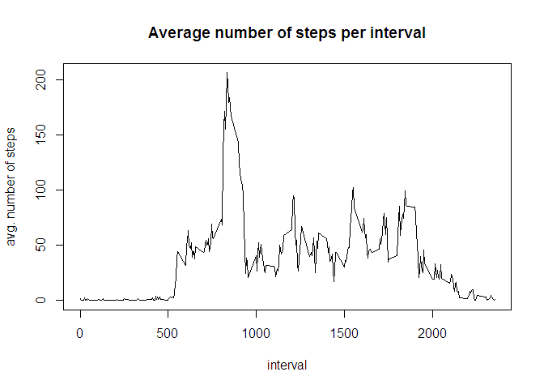
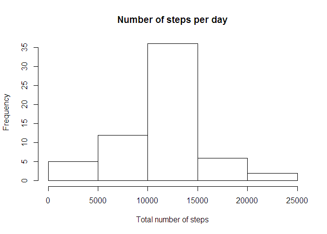
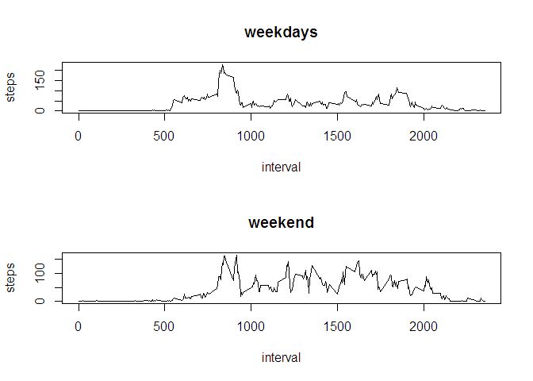

# Reproducible Research: Peer Assessment 1


## Loading and preprocessing the data

I loaded the data without any further preprocessing


```r
library(dplyr)
activitydata <- read.csv("activity.csv")
```
## What is mean total number of steps taken per day?
Calculating the mean total number of steps per day:


```r
#ignore missing values
activitydata <- na.omit(activitydata)

#make a grouping object
grp <- group_by(activitydata, date)

#do a sum with the above grouping 
stepsperday <- summarise(grp,sum(steps))

#calculate 'mean' and 'median'
mean <- mean(as.matrix(na.omit(stepsperday[,2]) ) )
median <- median(as.matrix(na.omit(stepsperday[,2]) ) )
```
This is a histogram of the total steps per day: 


```r
hist(as.matrix(stepsperday[,2]), main="Number of steps per day", xlab="Total number of steps")
```

 

The mean of the total number of steps per day is 1.0766189\times 10^{4}    
The median  of the total number of steps per day is 1.0765\times 10^{4}

## What is the average daily activity pattern?


```r
#make a grouping object (grouping by interval)
grp <- group_by(activitydata, interval)

#perform a aggregation on average number of steps
avgstepsperinterval <- summarise(grp,mean(steps))

#get the maximum value of avg number of steps
maxavgnumberofstepperinterval <- max(avgstepsperinterval[,2])

#get the interval with the max number
intervalwithmaxavgnumberofsteps <-subset(avgstepsperinterval, avgstepsperinterval[,2] == maxavgnumberofstepperinterval)[1] 
```
Here is a plot of the average number of steps per interval:


```r
plot(as.matrix(avgstepsperinterval[,1]),as.matrix(avgstepsperinterval[,2] ), type = "l", xlab = "interval", ylab="avg. number of steps", main="Average number of steps per interval" )
```

 

The interval with the maximum average number of steps per interval is 835

## Imputing missing values

The strategy for imputing is inserting the average number of steps for the missing interval


```r
#read in the activitydata again but this time without omitting missing values
activitydata = read.csv("activity.csv")

#get all the indeces of missing values
indecesincompletecases = which(!complete.cases(activitydata))

#foreach missing case index
for (index in  indecesincompletecases) {
  
  #get the interval for that index
  currentInterval <- activitydata[index,3]
  
  #assign the avg number of steps for that interval
  activitydata[index,1] <- avgstepsperinterval[avgstepsperinterval$interval == currentInterval,2]   
}
```
The histogram of total number of steps each day after imputing data looks like this: 


```r
grp <- group_by(activitydata, date)
stepsperday <- summarise(grp,sum(steps))
hist(as.matrix(stepsperday[,2]), main="Number of steps per day", xlab="Total number of steps")
```

 

## Are there differences in activity patterns between weekdays and weekends?

First I create a new column in our data. With that column the new plots are generated


```r
#function for calculating whether is a weekday or weekendday (my language for some reason is dutch)
weekdaystring <- function(x) {  
  if (weekdays(as.Date(x[1]) ) == "zaterdag") {
     "weekend"
  }else if (weekdays(as.Date(x[1]) ) == "zondag") {
    "weekend"
  } else {    
  "weekday"
  }
}

#apply the function to every row of the data set and assign the outcome to a new column called daytype
activitydata$daytype = sapply(activitydata$date, weekdaystring)

#grouping object (group by daytype="weekend")
grpweekend <- group_by(subset(activitydata,daytype=="weekend"), interval)

#average number of steps per interval in weekend
avgstepsperintervalweekend <- summarise(grpweekend,mean(steps))

#grouping object (group by daytype="weekday")
grpweekday <- group_by(subset(activitydata,daytype=="weekday"), interval)

#average number of steps per interval in weekday
avgstepsperintervalweekday <- summarise(grpweekday,mean(steps))
```

Plot the obtained plots in two separate rows:


```r
par(mfrow=c(2,1))
plotweekday <- plot(as.matrix(avgstepsperintervalweekday[,1]),as.matrix(avgstepsperintervalweekday[,2] ), type = "l", main="weekdays", ylab="steps", xlab="interval")
plotweekend <- plot(as.matrix(avgstepsperintervalweekend[,1]),as.matrix(avgstepsperintervalweekend[,2] ), type = "l", ylab="steps", xlab="interval", main="weekend")
```

 

